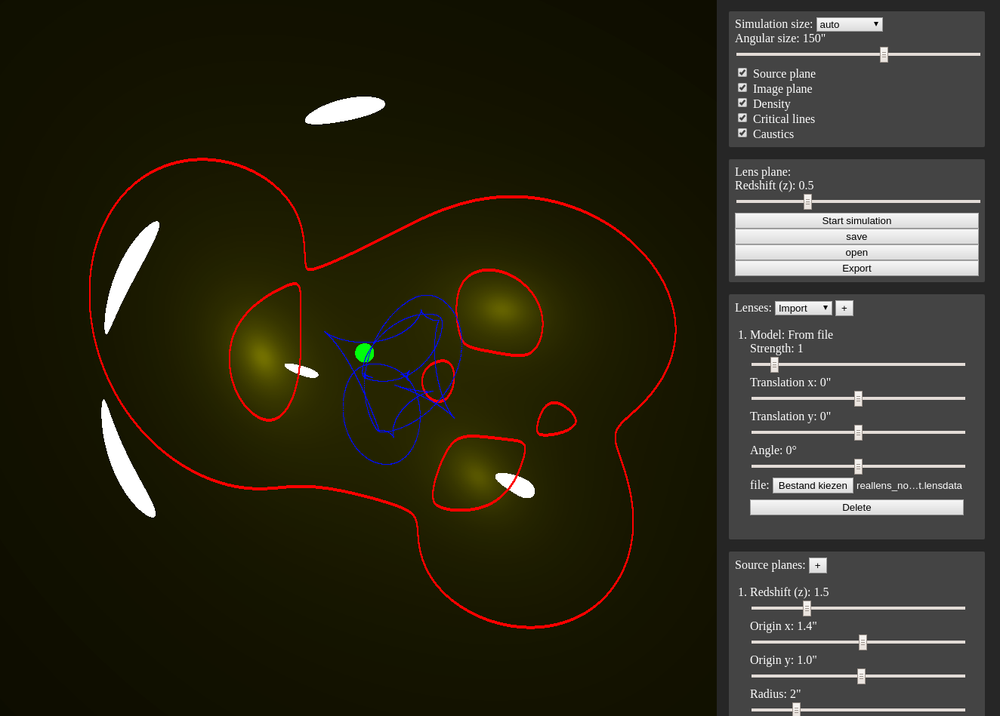

# gravitational-lenses-webgl
Interactive simulation of gravitational lenses using WebGL

## building
Compiled `.wasm` files are included in the repository, so compiling isn't necessary. If you make any changes, run `./build-grale.sh` to recompile. Emscripten must be installed for this to work.

## running
The application requires a webserver in order to run properly. So for example `php -S localhost:8000` will host the application at `localhost:8000` with the PHP development server. Note that the application only uses HTML, JavaScript and WebAssembly, so PHP is not a requirement.
